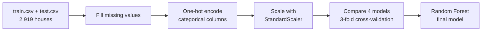

<h1 align="center">House Price Prediction</h1>

<p align="center">
  
  
  
  
</p>

<p align="center">Predicting house sale prices from 79 features of each house, using the Kaggle <i>House Prices: Advanced Regression Techniques</i> dataset (Ames, Iowa).</p>

---

## What I did

This was one of my first ML projects. Most of the work went into cleaning the data, since 35 of the 80 columns have missing values.



**Handling missing values**
- Categorical columns with a few gaps (like `MSZoning`, `Electrical`, `SaleType`) were filled with the most common value.
- Columns where a missing value means "the house doesn't have this" (like `Alley`, `PoolQC`, `Fence`, `FireplaceQu`) were filled with `"NA"`.
- Missing basement areas and bathroom counts were set to 0.
- A heatmap of missing values is saved in `Heat map.jpeg`.

**Features:** after one-hot encoding there are 4,633 features for 1,460 training houses.

## Results

R² score from 3-fold cross-validation on the training set (higher is better, 1.0 is perfect):

| Model | R² |
|---|---|
| **Random Forest** | **0.837** |
| Linear Regression | 0.729 |
| Decision Tree | 0.682 |
| SVR (default settings) | -0.052 |

Random Forest did best, so it was used for the final predictions on the test set. SVR did badly, most likely because it ran with default settings while the prices are in the hundreds of thousands.

## Files

| File | What it is |
|---|---|
| `House PRICE PREDICTION FINAL.ipynb` | The full notebook: cleaning, encoding, models |
| `train.csv`, `test.csv` | Kaggle data (1,460 and 1,459 houses) |
| `data_description.txt` | What each column means |
| `sample_submission.csv` | Kaggle's submission format |
| `Heat map.jpeg` | Heatmap of missing values |
| `Delhi 2021.csv` | Extra data file, not used in the notebook |

## How to run

```bash
git clone https://github.com/DarkMatter1217/House-price-prediction.git
cd House-price-prediction
pip install numpy pandas matplotlib seaborn scikit-learn jupyter
jupyter notebook "House PRICE PREDICTION FINAL.ipynb"
```

The notebook reads the CSVs from a Windows path on my laptop. Change the two `read_csv` lines at the top to `train.csv` and `test.csv` before running.

## What I would do differently now

- Predict `log(SalePrice)` instead of the raw price, since prices are skewed.
- Tune the Random Forest and try gradient boosting (XGBoost or LightGBM).
- Use a proper pipeline so the cleaning steps can be reused on new data.
